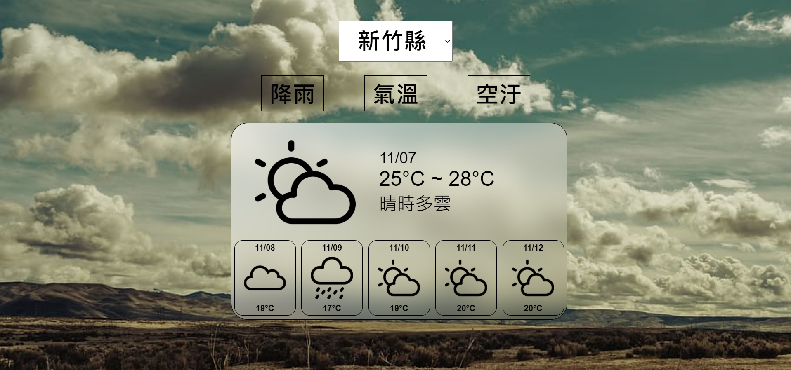
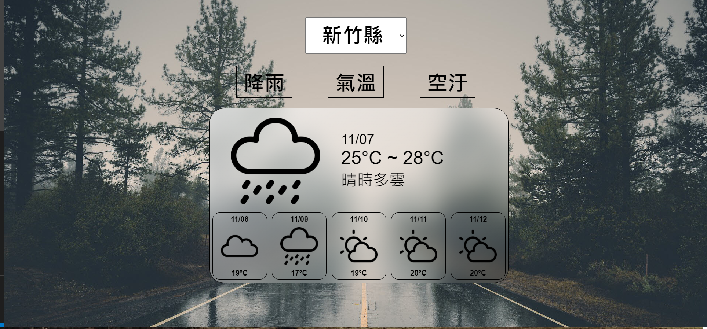
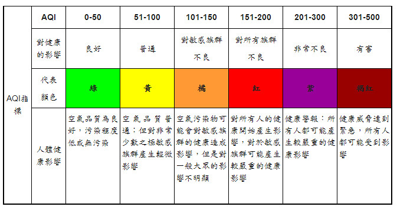
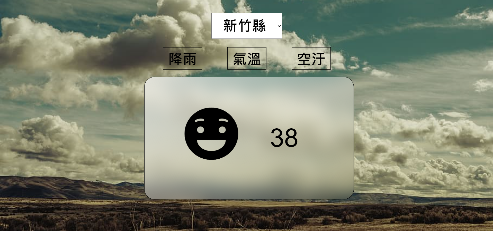
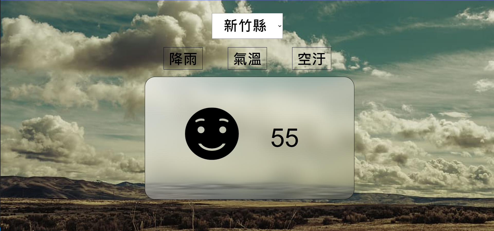
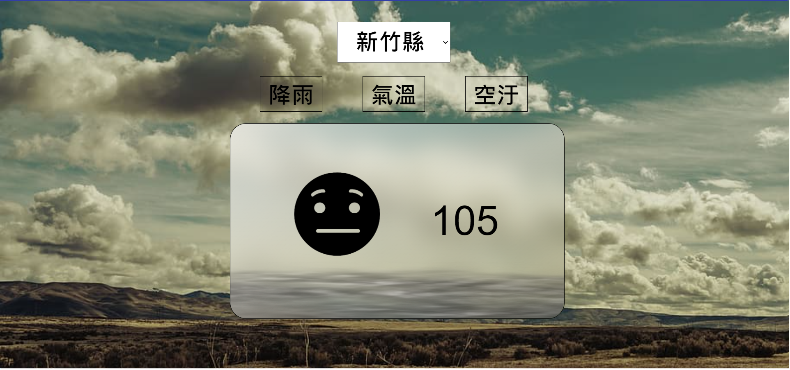
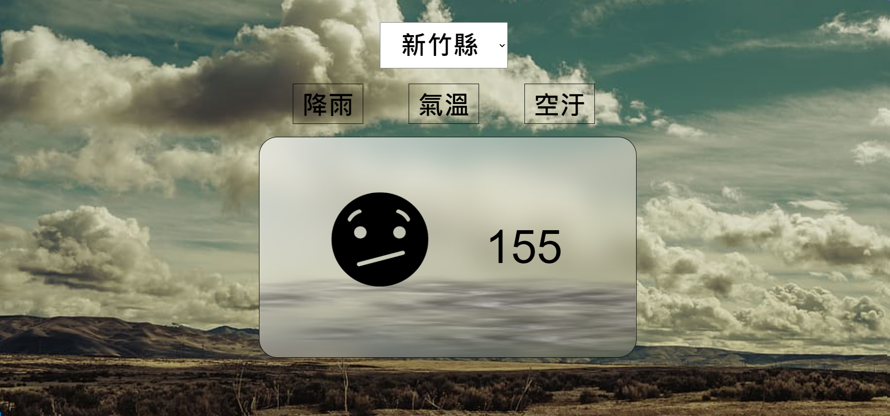
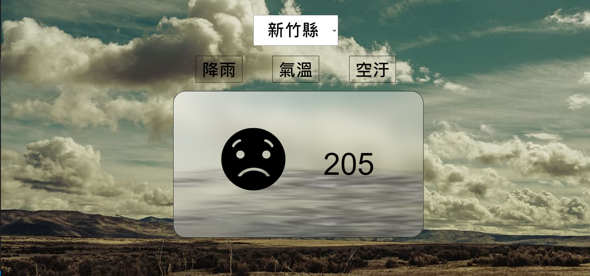
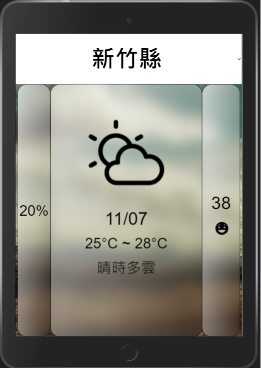
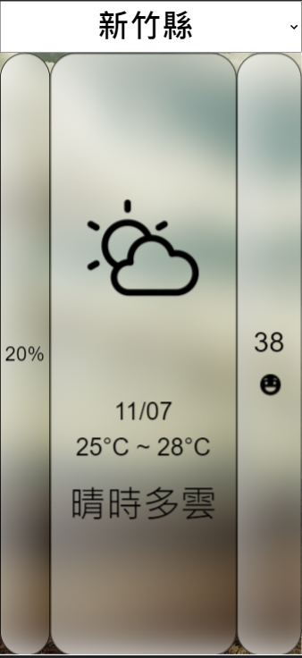

# <Strong>_Description_</Strong>

This is a web that can see the Taiwan weather,the chance of rain and the AQI num
 
The data is from [中央氣象局開放資料平臺], **sometimes the data may be wrong due to the data on this platform**. Please forgive me.
 
 

# <Strong>_Tools & Git page_</Strong>

 
 
<strong>Git page</strong> : https://fangjim.github.io/weather/

 

# <Strong>_Attention_</Strong>

Because the weather data may not be as performant as I want to show, I will directly change the code to show the effect directly, so there may be wrong data in some places, but in the actual application of the data, is no problem.

 

# <Strong>_Features_</Strong>

## <Strong>_PC screen_</Strong>

 

#### <Strong>Temperature</Strong>

The temperature part will show the high, low ℃ today and weather brief, the background and icon will change when the weather is different  **e.g.** if the weather is rainy today the theme will become rainy

 

#### <Strong>AQI</Strong>

There are five states, which respectively represent the severity of the air pollution. As the data increases, the icon’s face will get worse. The background smoke will also increase.

 

based on

 

0-50

51-100

101-150

151-200

201-300

301-500

 

## <Strong>_Mobile screen_</Strong>

Remove the forecast part and some effect let the screen more clear, if want to see the forecast can horizontal the phone

Pad

Phone

[中央氣象局開放資料平臺]: https://opendata.cwb.gov.tw/dist/opendata-swagger.html
